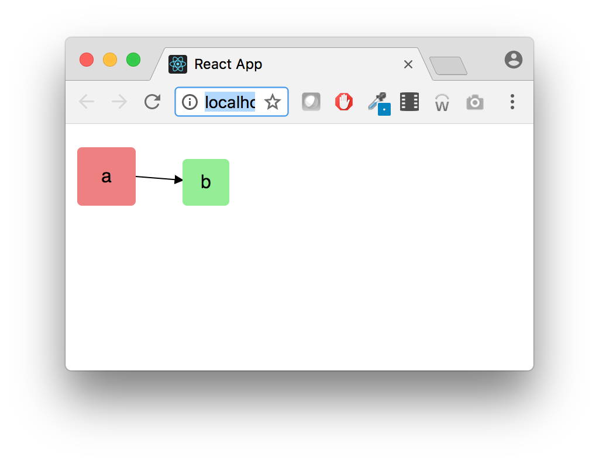

# Frontend coding challenge

**Important**
- Please read these instructions carefully!
- Please don't send any binaries or dependencies (like `node_modules`), only the source files!

## Task
Your task will be to visualize a diagram based on a model. You are free to use any frontend technology to achieve this goal (check the Evaluation section for how we will test your solution). We have a simple webpack build set up for you, but you are free to change it to whatever you like.

## Model (example)
```json
{
  "nodes": {
    "a": {
      "x": 10,
      "y": 20,
      "width": 50,
      "height": 50,
      "color": "lightcoral"
    },
    "b": {
      "x": 100,
      "y": 30,
      "width": 40,
      "height": 40,
      "color": "lightgreen"
    }
  },
  "links": [
    {
      "source": "a",
      "target": "b"
    }
  ]
}
```

Which should be visualized like this: 


## Nodes

All nodes will have properties describing their bounds - `x` and `y` for location, `width` and `height` for dimensions. Both units are in pixels and their coordinates are absolute on the screen. All nodes should have `color` as their background color. They should display the appropriate key in the node object as a label (e.g.: `a` or `b`)

## Links

Links will be represented by a `source` and a `target`. A link should be rendered as a line between two nodes. The direction of the link (from the source to the target) should be indicated by an arrow. The `source` and `target` should be clearly identifiable, and you should strive to make the line reasonably short (don't just connect top left coordinates). Apart from that, you are free to use any additional strategy for creating the links. You can assume that nodes will never intersect.

## Setting the input

You should expose a method called `visualize` on the global `window` object, which should take a single argument (shape described above) and visualize it. You should not perform input validation, you can expect that your method will be called with sane input. By default you should render the `input.json` file found in the `src` folder, which should look similar to this:


## Evaluation

We will perform the following set of actions to test your code:

- Decompress your solution & open the decompressed folder in a terminal
- `npm install`
- `npm start`
- Open http://localhost:3000 in a browser
- Call `window.visualize(...)` with test data from the debug console (possibly multiple times)

What will we check:

- The application is being correctly served at the expected endpoint
- `window.visualize(input)` renders the correct output
- Repeated calls to `window.visualize(input)` render the correct output without refreshing the page
- Code quality

## Bonus

Try to add drag and drop editing functionality!
